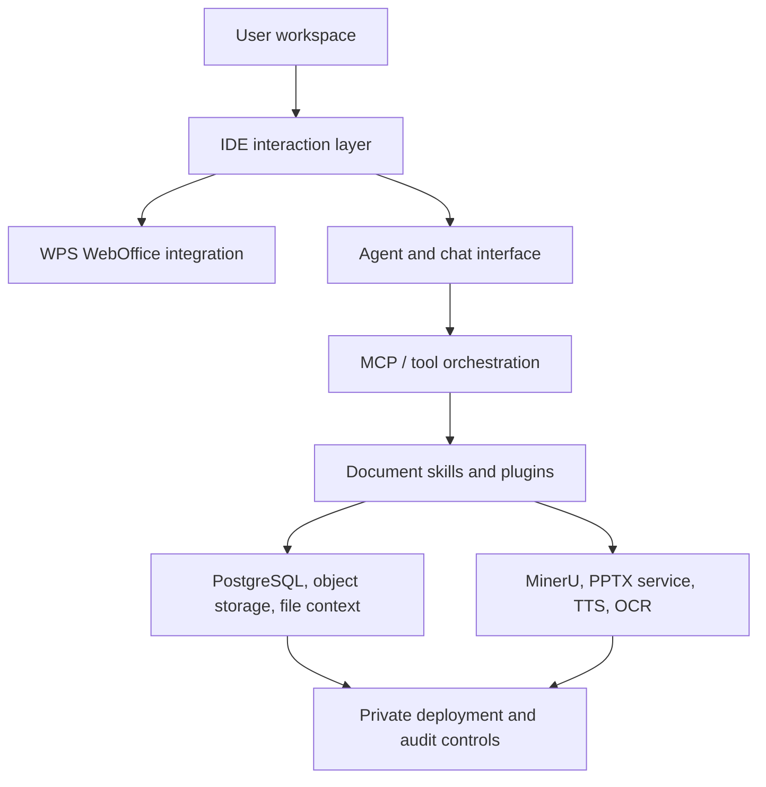

<p align="center">
  <a href="https://www.aiworkdeck.com">
    
  </a>
</p>

<h1 align="center">AI Workdeck</h1>

<p align="center">
  <strong>The AI-native workspace for legal and document-heavy work.</strong>
</p>

<p align="center">
  <a href="https://github.com/zeweihan/aiworkdeck/stargazers"></a>
  <a href="https://github.com/zeweihan/aiworkdeck/network/members"></a>
  <a href="https://github.com/zeweihan/aiworkdeck/releases"></a>
  <a href="legal/LICENSE"></a>
  <a href="legal/COMMERCIAL-LICENSE.md"></a>
  <a href="https://www.aiworkdeck.com"></a>
  <a href="https://github.com/zeweihan/aiworkdeck/issues"></a>
</p>

<p align="center">
  English | <a href="https://www.aiworkdeck.com/zh">中文</a>
</p>

---

> **VS Code** gives developers one place for files, extensions, terminals, Git, and AI coding assistants.
>
> **AI Workdeck** aims to give lawyers and document-heavy teams one place for matters, documents, agents, plugins, evidence, and review.

## Why Star This Repo

Star AI Workdeck if you care about any of these problems:

- Building AI-native legal or professional-service workflows
- Moving from chatbot add-ons to a real workspace where files, context, agents, and plugins live together
- Self-hosting document AI infrastructure with private data, audit trails, and organization-level workflows
- Exploring MCP-style agent orchestration, document parsing, WPS WebOffice integration, AI slides, TTS, OCR, and evidence-chain workflows in one codebase

## What It Is

AI Workdeck Community Edition is the open-source kernel of AI Workdeck. It is not the full commercial SaaS product. The kernel is published so developers, law firms, legal-tech builders, and document-AI teams can inspect, self-host, integrate, and extend the core workflow infrastructure.

## Demo

| | |
|---|---|
| Website | [aiworkdeck.com](https://www.aiworkdeck.com) |
| Product walkthrough | [Intro video](https://www.aiworkdeck.com/videos/intro.mp4) |
| Feature showcase | [AI Workdeck Showcase](https://www.aiworkdeck.com/zh/showcase) |

## Core Capabilities

| Area | What the kernel provides |
|---|---|
| **Workspace** | Project/file tree, document staging, favorites, clipboard memory, work logs |
| **AI document work** | Drafting, review, extraction, desensitization, Markdown and document preview |
| **Agent layer** | Main agent interface, streaming responses, contextual file tags, MCP-oriented orchestration |
| **Document editing** | WPS WebOffice integration, online DOCX/XLSX editing, document links, diff viewing |
| **Parsing and generation** | MinerU document parsing, AI PPT generation, text-to-speech workflows |
| **Plugin surface** | Left-sidebar plugins, tool configuration, dedicated panes for vertical workflows |
| **Deployment** | Java/Spring backend, Vue/uni-app frontend, Electron desktop shell, Dockerized services |
| **Governance** | Private deployment path, audit-friendly workflow records, commercial licensing path |

## Architecture



## Quick Start

### Prerequisites

| Requirement | Version |
|---|---|
| Docker Desktop | Latest (for MinerU, PPTX, TTS services) |
| Java | 17+ (JDK 21 also supported) |
| Node.js | 18+ |
| PostgreSQL | 14+ |

### Steps

```bash
# 1. Clone
git clone https://github.com/zeweihan/aiworkdeck.git
cd aiworkdeck

# 2. Configure environment
cp backend/.env.example backend/.env.production
cp pptx-service/.env.example pptx-service/.env

# 3. Create database
# Create a PostgreSQL database named `checkba`
# or update backend environment variables for your own database name

# 4. Start all services
chmod +x restart-all.sh
./restart-all.sh
```

### Services

| Service | URL |
|---|---|
| Frontend | `http://localhost:5173` |
| Backend | `http://localhost:9696` |
| PPTX service | `http://localhost:5001` |
| MinerU service | `http://localhost:8001` |
| EasyVoice | `http://localhost:9549` |

Common optional providers: OpenRouter, Gemini, Qichacha, Tushare, ElevenLabs, PKULaw, WPS WebOffice, and object storage. Not every provider is required to inspect the code or run the basic workbench.

## Repository Map

| Path | Purpose |
|---|---|
| `backend/` | Spring Boot backend, agent/tool APIs, document services |
| `frontend/` | Vue/uni-app web frontend for the workbench |
| `desktop/` | Electron desktop shell |
| `pptx-service/` | AI-native PPT generation service |
| `mineru-service/` | MinerU-based document parsing service |
| `easyvoice/` | Text-to-speech service |
| `docs/` | Engineering notes, WPS integration notes, storage and workflow docs |
| `legal/` | AGPLv3 license, CLA, commercial license, trademark terms |

## Roadmap

- [ ] Cleaner one-command local demo with sample data
- [ ] Public plugin SDK and example plugins
- [ ] More legal-document workflows: due diligence, shareholder meeting review, contract review, evidence timelines
- [ ] Better self-hosting guides for private law-firm and enterprise deployments
- [ ] More auditable work records: version history, diff, citations, and review logs
- [ ] Bilingual documentation for the community edition

## Contributing

We welcome issues, discussions, docs improvements, integration notes, and focused pull requests. Please read [CONTRIBUTING.md](.github/CONTRIBUTING.md) before submitting a PR.

Useful first contributions:

- Reproduce and document local setup paths on different operating systems
- Improve self-hosting docs and `.env` examples
- Add plugin examples
- Add tests around document parsing, agent tool calls, and frontend workflows
- Improve English and Chinese documentation

## Licensing

AI Workdeck Community Edition is released under the GNU Affero General Public License v3.0.

If you modify this project and provide it as a network service, AGPLv3 generally requires that you provide the corresponding source code to users of that service.

Commercial licensing is available for:

- Closed-source SaaS delivery
- Proprietary on-premise delivery
- Commercial products that need to integrate the kernel without releasing proprietary modifications
- Dedicated enterprise support and implementation assistance

See [LICENSE](legal/LICENSE) and [COMMERCIAL-LICENSE.md](legal/COMMERCIAL-LICENSE.md). For commercial licensing, contact [hi@aiworkdeck.com](mailto:hi@aiworkdeck.com).

## Background

Read [WHY.md](WHY.md) for the product thesis and founder story.

---

<p align="center">
  If this direction matters to you, please <a href="https://github.com/zeweihan/aiworkdeck/stargazers">⭐ star the repo</a> and share it with someone building legal AI, document AI, or professional-service infrastructure.
</p>
