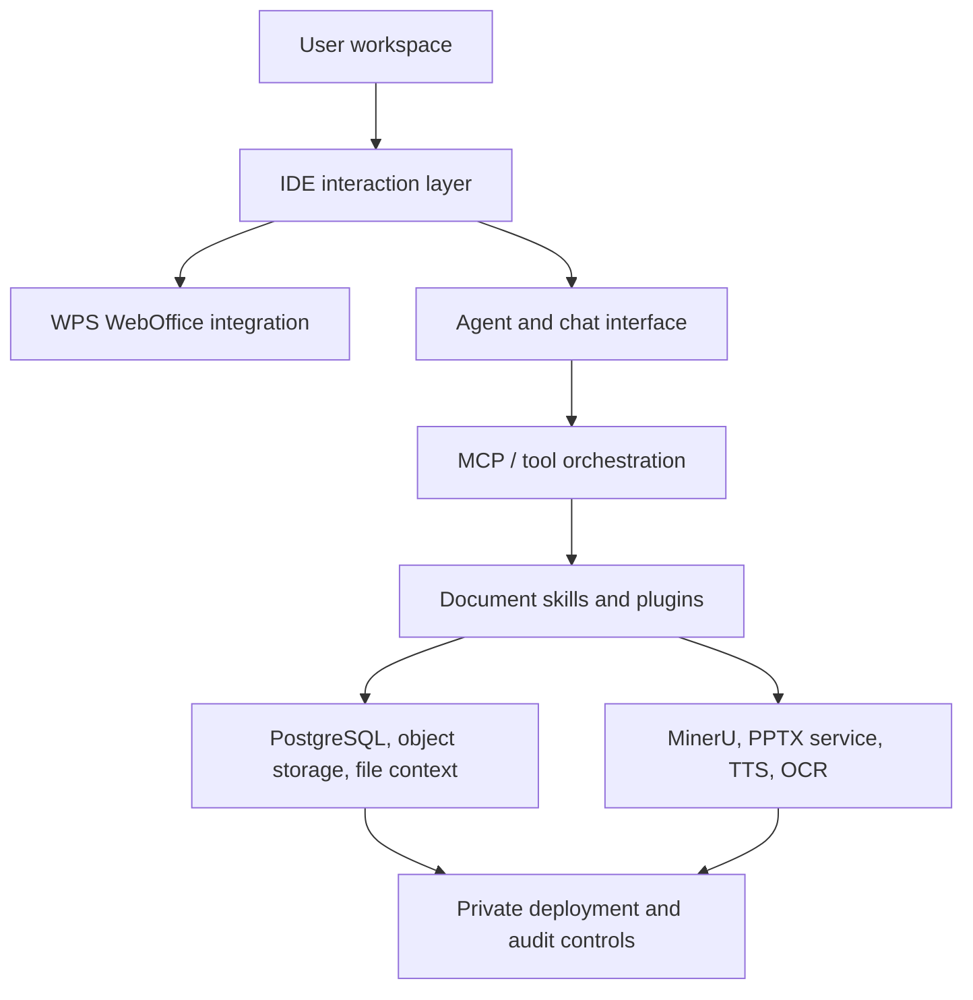

<p align="center">
  <a href="https://www.aiworkdeck.com">
    
  </a>
</p>

<h1 align="center">AI Workdeck</h1>

<p align="center">
  <strong>The AI-native workspace for legal and document-heavy work.</strong>
</p>

<p align="center">
  <a href="https://github.com/zeweihan/aiworkdeck/stargazers"></a>
  <a href="https://github.com/zeweihan/aiworkdeck/network/members"></a>
  <a href="https://github.com/zeweihan/aiworkdeck/releases"></a>
  <a href="legal/LICENSE"></a>
  <a href="legal/COMMERCIAL-LICENSE.md"></a>
  <a href="https://www.aiworkdeck.com"></a>
  <a href="https://github.com/zeweihan/aiworkdeck/issues"></a>
  <a href="https://star-history.com/#zeweihan/aiworkdeck&Date"></a>
</p>

<p align="center">
  English | <a href="https://www.aiworkdeck.com/zh">中文</a>
</p>

---

> **VS Code** gives developers one place for files, extensions, terminals, Git, and AI coding assistants.
>
> **AI Workdeck** aims to give lawyers and document-heavy teams one place for matters, documents, agents, plugins, evidence, and review.

## Why Star This Repo

Star AI Workdeck if you care about any of these problems:

- Building AI-native legal or professional-service workflows
- Moving from chatbot add-ons to a real workspace where files, context, agents, and plugins live together
- Self-hosting document AI infrastructure with private data, audit trails, and organization-level workflows
- Exploring MCP-style agent orchestration, document parsing, WPS WebOffice integration, AI slides, TTS, OCR, and evidence-chain workflows in one codebase

## What It Is

AI Workdeck Community Edition is the open-source kernel of AI Workdeck. It is not the full commercial SaaS product. The kernel is published so developers, law firms, legal-tech builders, and document-AI teams can inspect, self-host, integrate, and extend the core workflow infrastructure.

## Demo

| | |
|---|---|
| Website | [aiworkdeck.com](https://www.aiworkdeck.com) |
| Product walkthrough | [Intro video](https://www.aiworkdeck.com/videos/intro.mp4) |
| Feature showcase | [AI Workdeck Showcase](https://www.aiworkdeck.com/zh/showcase) |

## Core Capabilities

| Area | What the kernel provides |
|---|---|
| **Workspace** | Project/file tree, document staging, favorites, clipboard memory, work logs |
| **AI document work** | Drafting, review, extraction, desensitization, Markdown and document preview |
| **Agent layer** | Main agent interface, streaming responses, contextual file tags, MCP-oriented orchestration |
| **Document editing** | WPS WebOffice integration, online DOCX/XLSX editing, document links, diff viewing |
| **Parsing and generation** | MinerU document parsing, AI PPT generation, text-to-speech workflows |
| **Plugin surface** | Left-sidebar plugins, tool configuration, dedicated panes for vertical workflows |
| **Deployment** | Java/Spring backend, Vue/uni-app frontend, Electron desktop shell, Dockerized services |
| **Governance** | Private deployment path, audit-friendly workflow records, commercial licensing path |

## Architecture




## Data Processing & Privacy

AI Workdeck is designed for **self-hosted, private deployment**. The following diagram shows which components process data locally vs. externally:

```
┌─────────────────────────────────────────────────────────────────┐
│  Your Infrastructure (private network)                          │
│                                                                 │
│  ┌──────────┐  ┌──────────┐  ┌──────────┐  ┌────────────────┐  │
│  │ AI Agent │  │  MinerU  │  │   PPTX   │  │ Sensitive Data │  │
│  │ (Ollama) │  │ (Docker) │  │ (Docker) │  │    Masking     │  │
│  │  LOCAL   │  │  LOCAL   │  │  LOCAL   │  │     LOCAL      │  │
│  └──────────┘  └──────────┘  └──────────┘  └────────────────┘  │
│                                                                 │
│  ┌──────────┐  ┌──────────┐  ┌──────────────────────────────┐  │
│  │PostgreSQL│  │   RAG    │  │    Local File Storage        │  │
│  │  LOCAL   │  │  LOCAL   │  │          LOCAL               │  │
│  └──────────┘  └──────────┘  └──────────────────────────────┘  │
│                                                                 │
├────────────────────────── Optional External ────────────────────┤
│  ┌──────────┐  ┌──────────┐  ┌──────────┐  ┌──────────────┐   │
│  │   OCR    │  │   TTS    │  │ Company  │  │  Gemini /    │   │
│  │ (Aliyun) │  │(ElevenLb)|  │(Qichacha)│  │  OpenRouter  │   │
│  │ EXTERNAL │  │ EXTERNAL │  │ EXTERNAL │  │  CONFIGURABLE│   │
│  └──────────┘  └──────────┘  └──────────┘  └──────────────┘   │
└─────────────────────────────────────────────────────────────────┘
```

| Component | Default Location | Can Run Locally? | Notes |
|---|---|---|---|
| AI inference (chat/agent) | Local (Ollama) | ✅ Yes | Default is localhost:11434 |
| RAG / embeddings | Local (Apache Tika) | ✅ Yes | InMemoryEmbeddingStore |
| Document parsing (MinerU) | Local (Docker) | ✅ Yes | No external call |
| PPTX generation | Local (Docker) | ✅ Yes | No external call |
| Sensitive data masking | Local (regex) | ✅ Yes | Chinese PII patterns, no external call |
| Document storage | Local filesystem | ✅ Yes | Configurable: local / OSS / S3 |
| OCR | **External** (Aliyun) | ⚠️ No fallback | Can be disabled |
| Text-to-speech | **External** (ElevenLabs) | ⚠️ No fallback | Can be disabled |
| Company data lookup | **External** (Qichacha) | ⚠️ No fallback | Optional feature |
| AI model (cloud) | **External** (Gemini/OpenRouter) | ✅ Use Ollama | Configurable provider |

**For air-gapped deployments**: Ollama + local storage + MinerU + PPTX service keeps all documents entirely within your network. Disable OCR, TTS, and cloud AI providers — the core workspace, document editing, agent orchestration, and due-diligence workflows function without external services.

## Evidence Chain & Audit Status

> **Status**: Foundation in place, cryptographic provenance is on the roadmap.

The Community Edition currently provides **relational audit logging**:

- **Activity logging**: `UserActivityLog` records every user action (LOGIN, OPEN_FILE, PAGE_VIEW, etc.) with timestamps via Hibernate `@CreationTimestamp` and metadata stored as JSON
- **Due-diligence tracking**: `DdItem` records state transitions (PENDING → UPLOADED → APPROVED/REJECTED) with `uploadedAt` and `uploadedBy`
- **Conversation audit**: `ConversationFileChange` logs document additions and modifications per session
- **File metadata**: `ProjectFile` stores `createdAt`/`updatedAt` timestamps and file paths in PostgreSQL

**What is NOT yet implemented** (on the roadmap):
- Cryptographic document hashing (SHA-256 checksums)
- Tamper-evident audit trails (Merkle chains or signed logs)
- File version history and diff tracking
- Immutable append-only evidence log

The architecture's plugin surface is designed to accommodate these features. If you need cryptographic provenance for compliance or litigation support, please open an issue describing your requirements — it helps us prioritize.

## Licensing FAQ for Law Firms

### Can our firm use AI Workdeck internally without disclosing our modifications?

**Yes, in most cases.** AGPLv3's disclosure obligation is triggered when you *convey* modified software to others — i.e., distribute or provide it as a network service to external users. Internal use within a single firm, even with modifications, generally does not require source code disclosure.

### What about the network-use clause (AGPLv3 Section 13)?

This clause applies when you host a modified version as a **network service accessible to external users**. If you deploy AI Workdeck as an internal tool behind your firm's firewall, the network-use clause does not apply. If you create a client-facing portal powered by modified AI Workdeck code, AGPLv3 would require offering the source to those clients.

### What about proprietary plugins and extensions?

The current architecture runs plugins in-process. Under AGPLv3, this means the copyleft *may* extend to proprietary plugins. If your firm plans to build proprietary workflow extensions, the **commercial license** provides a clean legal basis for:
- Closed-source plugins and integrations
- Proprietary on-premise deployment without source disclosure
- Commercial SaaS products built on the AI Workdeck kernel

See [`legal/COMMERCIAL-LICENSE.md`](legal/COMMERCIAL-LICENSE.md) or contact [hi@aiworkdeck.com](mailto:hi@aiworkdeck.com).

### Where does our data go?

In a self-hosted deployment with Ollama + local storage + Docker services, **documents never leave your network**. No telemetry, no phone-home, no analytics by default. Optional external services (OCR, TTS, cloud AI) are explicitly configured and can be disabled entirely.

## Quick Start

### Prerequisites

| Requirement | Version |
|---|---|
| Docker Desktop | Latest (for MinerU, PPTX, TTS services) |
| Java | 17+ (JDK 21 also supported) |
| Node.js | 18+ |
| PostgreSQL | 14+ |

### Steps

```bash
# 1. Clone
git clone https://github.com/zeweihan/aiworkdeck.git
cd aiworkdeck

# 2. Configure environment
cp backend/.env.example backend/.env.production
cp pptx-service/.env.example pptx-service/.env

# 3. Create database
# Create a PostgreSQL database named `checkba`
# or update backend environment variables for your own database name

# 4. Start all services
chmod +x restart-all.sh
./restart-all.sh
```

### Services

| Service | URL |
|---|---|
| Frontend | `http://localhost:5173` |
| Backend | `http://localhost:9696` |
| PPTX service | `http://localhost:5001` |
| MinerU service | `http://localhost:8001` |
| EasyVoice | `http://localhost:9549` |

Common optional providers: OpenRouter, Gemini, Qichacha, Tushare, ElevenLabs, PKULaw, WPS WebOffice, and object storage. Not every provider is required to inspect the code or run the basic workbench.

## Repository Map

| Path | Purpose |
|---|---|
| `backend/` | Spring Boot backend, agent/tool APIs, document services |
| `frontend/` | Vue/uni-app web frontend for the workbench |
| `desktop/` | Electron desktop shell |
| `pptx-service/` | AI-native PPT generation service |
| `mineru-service/` | MinerU-based document parsing service |
| `easyvoice/` | Text-to-speech service |
| `docs/` | Engineering notes, WPS integration notes, storage and workflow docs |
| `legal/` | AGPLv3 license, CLA, commercial license, trademark terms |

## Roadmap

- [ ] Cleaner one-command local demo with sample data
- [ ] Public plugin SDK and example plugins
- [ ] More legal-document workflows: due diligence, shareholder meeting review, contract review, evidence timelines
- [ ] Better self-hosting guides for private law-firm and enterprise deployments
- [ ] More auditable work records: version history, diff, citations, and review logs
- [ ] Bilingual documentation for the community edition

## Contributing

We welcome issues, discussions, docs improvements, integration notes, and focused pull requests. Please read [CONTRIBUTING.md](.github/CONTRIBUTING.md) before submitting a PR.

Useful first contributions:

- Reproduce and document local setup paths on different operating systems
- Improve self-hosting docs and `.env` examples
- Add plugin examples
- Add tests around document parsing, agent tool calls, and frontend workflows
- Improve English and Chinese documentation

## Licensing

AI Workdeck Community Edition is released under the GNU Affero General Public License v3.0.

If you modify this project and provide it as a network service, AGPLv3 generally requires that you provide the corresponding source code to users of that service.

Commercial licensing is available for:

- Closed-source SaaS delivery
- Proprietary on-premise delivery
- Commercial products that need to integrate the kernel without releasing proprietary modifications
- Dedicated enterprise support and implementation assistance

See [LICENSE](legal/LICENSE) and [COMMERCIAL-LICENSE.md](legal/COMMERCIAL-LICENSE.md). For commercial licensing, contact [hi@aiworkdeck.com](mailto:hi@aiworkdeck.com).

## Background

Read [WHY.md](WHY.md) for the product thesis and founder story.

---

## ⭐ Star History

[](https://star-history.com/#zeweihan/aiworkdeck&Date)

<p align="center">
  If this direction matters to you, please <a href="https://github.com/zeweihan/aiworkdeck/stargazers">⭐ star the repo</a> and share it with someone building legal AI, document AI, or professional-service infrastructure.
</p>
