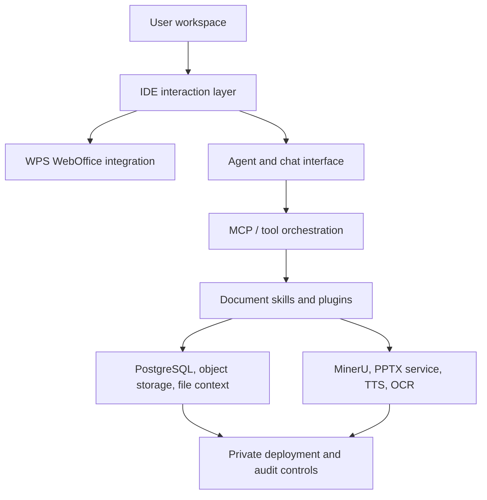

# AI Workdeck

> The AI-native workspace for legal and document-heavy work.

AI Workdeck is an IDE-style workbench that brings case files, document editing,
AI agents, plugins, document parsing, and auditable work records into one deck.

中文定位: 法律行业的 AI 工作环境与基础设施。不是把 AI 插进每个旧系统,
而是把案件、文档、检索、协作和 Agent 放回同一个工作台。

[](https://github.com/zeweihan/aiworkdeck/stargazers)
[](legal/LICENSE)
[](legal/COMMERCIAL-LICENSE.md)
[](https://www.aiworkdeck.com)

<p align="center">
  <a href="https://www.aiworkdeck.com/zh/showcase">
    
  </a>
</p>

## Why Star This Repo

Star AI Workdeck if you care about any of these problems:

- Building AI-native legal or professional-service workflows.
- Moving from chatbot add-ons to a real workspace where files, context, agents,
  and plugins live together.
- Self-hosting document AI infrastructure with private data, audit trails, and
  organization-level workflows.
- Exploring MCP-style agent orchestration, document parsing, WPS WebOffice
  integration, AI slides, TTS, OCR, and evidence-chain workflows in one codebase.

## What It Is

AI Workdeck Community Edition is the open-source kernel of AI Workdeck. It is
not the full commercial SaaS product. The kernel is published so developers,
law firms, legal-tech builders, and document-AI teams can inspect, self-host,
integrate, and extend the core workflow infrastructure.

The simplest mental model:

> VS Code gives developers one place for files, extensions, terminals, Git, and
> AI coding assistants. AI Workdeck aims to give lawyers and document-heavy teams
> one place for matters, documents, agents, plugins, evidence, and review.

## Demo

- Website: [aiworkdeck.com](https://www.aiworkdeck.com)
- Product walkthrough: [intro video](https://www.aiworkdeck.com/videos/intro.mp4)
- Feature showcase: [AI Workdeck Showcase](https://www.aiworkdeck.com/zh/showcase)

## Core Capabilities

| Area | What the kernel provides |
| --- | --- |
| Workspace | Project/file tree, document staging, favorites, clipboard memory, work logs |
| AI document work | Drafting, review, extraction, desensitization, Markdown and document preview |
| Agent layer | Main agent interface, streaming responses, contextual file tags, MCP-oriented orchestration |
| Document editing | WPS WebOffice integration, online DOCX/XLSX editing, document links, diff viewing |
| Parsing and generation | MinerU document parsing, AI PPT generation, text-to-speech workflows |
| Plugin surface | Left-sidebar plugins, tool configuration, dedicated panes for vertical workflows |
| Deployment | Java/Spring backend, Vue/uni-app frontend, Electron desktop shell, Dockerized services |
| Governance | Private deployment path, audit-friendly workflow records, commercial licensing path |

## Architecture



## Repository Map

| Path | Purpose |
| --- | --- |
| `backend/` | Spring Boot backend, agent/tool APIs, document services |
| `frontend/` | Vue/uni-app web frontend for the workbench |
| `desktop/` | Electron desktop shell |
| `pptx-service/` | AI-native PPT generation service |
| `mineru-service/` | MinerU-based document parsing service |
| `easyvoice/` | Text-to-speech service |
| `docs/` | Engineering notes, WPS integration notes, storage and workflow docs |
| `legal/` | AGPLv3 license, CLA, commercial license, trademark terms |

## Quick Start

### 1. Clone

```bash
git clone https://github.com/zeweihan/aiworkdeck.git
cd aiworkdeck
```

### 2. Install Prerequisites

- Docker Desktop for MinerU, PPTX, and TTS services.
- Java 17+ for the Spring Boot backend. JDK 21 is also supported.
- Node.js 18+ for the frontend and Electron desktop app.
- PostgreSQL for the backend database.

Create a database named `checkba`, or update the backend environment variables
to use your own database name.

### 3. Configure Environment Files

Copy the examples and fill in the providers you actually need:

```bash
cp backend/.env.example backend/.env.production
cp pptx-service/.env.example pptx-service/.env
```

Common optional providers include OpenRouter, Gemini, Qichacha, Tushare,
ElevenLabs, PKULaw, WPS WebOffice, and object storage. Not every provider is
required to inspect the code or run the basic workbench.

### 4. Start Services

```bash
chmod +x restart-all.sh
./restart-all.sh
```

The script checks local dependencies, stops old processes, builds the backend,
and starts the frontend, desktop shell, and Docker services where available.

Typical local ports:

| Service | URL |
| --- | --- |
| Frontend | `http://localhost:5173` |
| Backend | `http://localhost:9696` |
| PPTX service | `http://localhost:5001` |
| MinerU service | `http://localhost:8001` |
| EasyVoice | `http://localhost:9549` |

## Roadmap

- Cleaner one-command local demo with sample data.
- Public plugin SDK and example plugins.
- More legal-document workflows: due diligence, shareholder meeting review,
  contract review, evidence timelines.
- Better self-hosting guides for private law-firm and enterprise deployments.
- More auditable work records: version history, diff, citations, and review logs.
- Bilingual documentation for the community edition.

## Licensing

AI Workdeck Community Edition is released under the GNU Affero General Public
License v3.0.

If you modify this project and provide it as a network service, AGPLv3 generally
requires that you provide the corresponding source code to users of that service.

Commercial licensing is available for:

- Closed-source SaaS delivery.
- Proprietary on-premise delivery.
- Commercial products that need to integrate the kernel without releasing
  proprietary modifications.
- Dedicated enterprise support and implementation assistance.

See [LICENSE](legal/LICENSE) and
[COMMERCIAL-LICENSE.md](legal/COMMERCIAL-LICENSE.md). For commercial licensing,
contact [hi@aiworkdeck.com](mailto:hi@aiworkdeck.com).

## Contributing

We welcome issues, discussions, docs improvements, integration notes, and focused
pull requests. Please read [.github/CONTRIBUTING.md](.github/CONTRIBUTING.md)
before submitting a PR.

Useful first contributions:

- Reproduce and document local setup paths on different operating systems.
- Improve self-hosting docs and `.env` examples.
- Add plugin examples.
- Add tests around document parsing, agent tool calls, and frontend workflows.
- Improve English and Chinese documentation.

## Background

Read [WHY.md](WHY.md) for the product thesis and founder story.

If this direction matters to you, please star the repo and share it with someone
building legal AI, document AI, or professional-service infrastructure.
